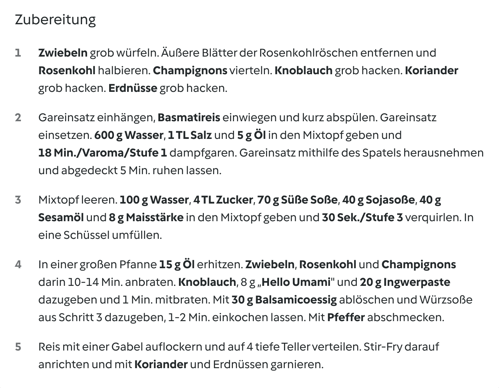
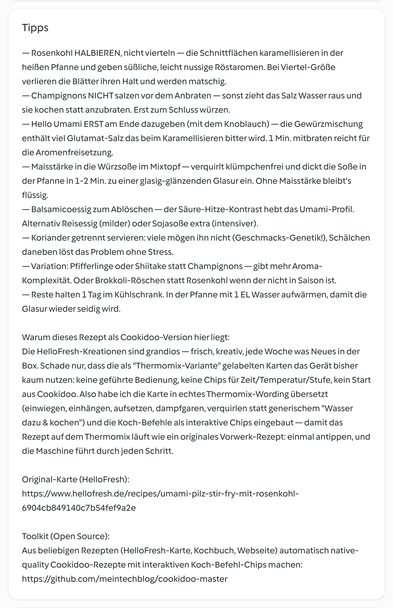

# [#18] Umami-Pilz-Stir-Fry mit Rosenkohl

dazu Basmatireis, Koriander & Erdnüsse · vegan · 4 Portionen

## Kennzahlen

| | |
|---|---|
| **Quelle** | HelloFresh Wochenbox, Karte #18 |
| **Portionen** | 4 |
| **Arbeitszeit** | ca. 25 Min. |
| **Gesamtzeit** | ca. 35 Min. |
| **Schwierigkeit** | einfach |
| **Diät** | vegan |
| **Cookidoo-Rezept (privat, eingeloggt)** | https://cookidoo.de/created-recipes/de-DE/01KRQ3TEB572NJEE7GB4FDRFG5 |
| **Cookidoo-Rezept (öffentlich)** | https://cookidoo.de/created-recipes/public/recipes/de-DE/01KRQ3TEB572NJEE7GB4FDRFG5 |
| **Original HelloFresh-Rezept** | https://www.hellofresh.de/recipes/umami-pilz-stir-fry-mit-rosenkohl-6904cb849140c7b54fef9a2e |
| **Foto** | © Jörg Hofmann (eigene Aufnahme) |

## Zutaten (4P)

- 300 g Basmatireis
- 8 g Gewürzmischung „Hello Umami"
- 400 g Champignons
- 300 g Rosenkohl
- 2 Zwiebeln
- 4 Knoblauchzehen
- 20 g Ingwerpaste
- 70 g Süße Soße, Asiatische Art
- 40 g Sojasoße, salzreduziert
- 40 g Sesamöl
- 8 g Maisstärke
- 40 g Erdnüsse, geröstet und gesalzen
- 20 g Koriander, frisch
- 30 g Balsamicoessig
- 20 g Öl
- 4 TL Zucker
- 700 g Wasser
- 1 TL Salz
- 1-2 Prisen Pfeffer

## Zubereitung — 12 Schritte mit interaktiven Koch-Befehlen

1. **2 Zwiebeln** grob würfeln, **400 g Champignons** vierteln und **4 Knoblauchzehen** grob hacken.
2. Die äußeren Blätter von **300 g Rosenkohl** entfernen und die Röschen halbieren.
3. Gareinsatz einhängen, **300 g Basmatireis** einwiegen und kalt abspülen.
4. **600 g Wasser**, **1 TL Salz** und **5 g Öl** in den Mixtopf geben, den Gareinsatz einsetzen und **`18 Min./Varoma/Stufe 1`** dampfgaren.
5. Den Gareinsatz mit dem Reis mithilfe des Spatels herausnehmen und abgedeckt 5 Min. ruhen lassen.
6. Mixtopf leeren. **100 g Wasser**, **4 TL Zucker**, **70 g Süße Soße**, **40 g Sojasoße**, **40 g Sesamöl**, **20 g Ingwerpaste** und **8 g Maisstärke** in den Mixtopf geben und **`30 Sek./Stufe 3`** verquirlen. In eine Schüssel umfüllen.
7. In einer großen Pfanne **15 g Öl** erhitzen und die Zwiebeln, den Rosenkohl und die Champignons 10–14 Min. anbraten.
8. Den Knoblauch und **8 g Gewürzmischung „Hello Umami"** zugeben und 1 Min. mitbraten.
9. Mit **30 g Balsamicoessig** ablöschen, die Würzsoße zugeben und 1–2 Min. einkochen lassen. Mit Pfeffer abschmecken.
10. Den Reis mit einer Gabel auflockern und auf 4 tiefe Teller verteilen.
11. **20 g Koriander** und **40 g Erdnüsse** grob hacken.
12. Das Stir-Fry auf dem Reis anrichten und mit dem Koriander und den Erdnüssen garnieren.

## Tipps

- Rosenkohl halbieren, nicht vierteln — die Schnittflächen karamellisieren, die Blätter bleiben dran.
- Champignons nicht vor dem Anbraten salzen — sonst ziehen sie Wasser und kochen statt zu bräunen.
- „Hello Umami" erst am Ende mit dem Knoblauch — das Glutamat-Salz wird beim Karamellisieren bitter.
- Maisstärke in die Würzsoße im Mixtopf — verquirlt klümpchenfrei und dickt zur glänzenden Glasur ein.
- Koriander getrennt reichen — nicht jeder mag ihn.

## Warum diese Cookidoo-Adaption

Die HelloFresh-Kreationen sind grandios — frisch, kreativ, jede Woche was Neues in der Box. Schade nur, dass die als „Thermomix-Variante" gelabelten Karten das Gerät bisher kaum nutzen: keine geführte Bedienung, keine Chips für Zeit/Temperatur/Stufe, kein Start aus Cookidoo.

Für diese Cookidoo-Version habe ich die Karte komplett in **echtes Thermomix-Wording** übersetzt:

- **Native Verben**: `einwiegen`, `einhängen`, `aufsetzen`, `dampfgaren`, `verquirlen`, `mithilfe des Spatels herausnehmen`, `unterheben`, `auf 4 Teller verteilen`, `... garnieren`.
- **Würzsoße im Mixtopf verquirlen** (statt in einer Schüssel): die Maisstärke löst sich klümpchenfrei in der Sojasoße-Sesamöl-Mischung — in der Pfanne dickt die Glasur dann in 1-2 Min. zu einer seidigen Konsistenz ein.
- **Reis im Gareinsatz dampfgaren** statt im Topf kochen: der Mixtopf wird trotzdem für die Würzsoße direkt danach gebraucht — also kein zusätzliches Equipment.
- **Spezifische Mengen** statt Catch-all: `1 TL Salz`, `20 g Öl`, `1-2 Prisen Pfeffer` als separate Zutatenzeilen.
- **Interaktive Koch-Befehl-Chips**: `18 Min./Varoma/Stufe 1` für den Reis und `30 Sek./Stufe 3` für die Würzsoße — beide sind im Cookidoo-Render keine Plain-Text-Strings, sondern hervorgehobene Chips. Der Thermomix führt sie beim Antippen direkt aus.
- **Step-Granularität nach Native-Standard**: 12 kurze Ein-Aktion-Schritte (Median ~85 statt vorher ~185 Zeichen). Mengen gegen die HelloFresh-Quelle abgeglichen: **700 g Wasser** (Zutatenliste sagte fälschlich 900 g, die Schritte brauchen 600 + 100 g) und **20 g Koriander** (vorher fälschlich 10 g, nicht hochskaliert).

Erstellt mit dem Open-Source-Toolkit [thermomix-master](https://github.com/meintechblog/thermomix-master), das beliebige Rezepte in ~2-5 Minuten in native-quality Cookidoo-Eigene-Rezepte umwandelt.

## So sieht's live auf Cookidoo aus

Öffentliche Vorschau (ohne Cookidoo-Login einsehbar):

Die Zubereitung mit den hervorgehobenen Koch-Befehlen:

Tipps + Quellen-Narrativ:

## Quelle & Lizenz

Original-Rezept stammt aus der HelloFresh-Wochenbox („Umami Stir-Fry mit Pilzen und Rosenkohl", Karte #18). Die Anpassung (Step-Reorganisation, Native-Verben, Mengen-Konsistenz, Mixtopf-Würzsoße statt Schüssel, Tipps) ist die Eigenarbeit für die Cookidoo-Version.

Das Hero-Bild ist eine **eigene Aufnahme** (© Jörg Hofmann, 2026) — daher kann das Rezept auf Cookidoo öffentlich geteilt werden.
