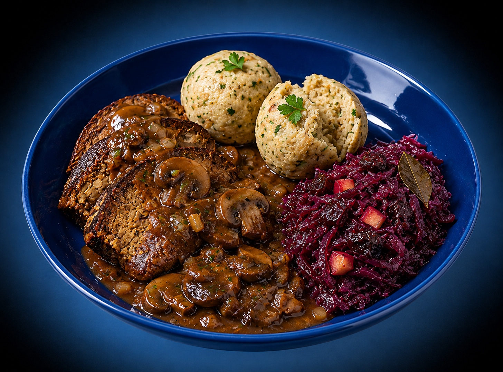

# Veganer Hackbraten mit Semmelknödeln, Schwarzbier-Pilz-Rahm & Apfel-Rotkohl

Wirtshaus-Klassiker im Thermomix · vegan · 4 Portionen · ca. 720 kcal/Portion

## Kennzahlen

| | |
|---|---|
| **Quelle** | Eigenkreation (Jörg Hofmann, 2026) — Beilagen-Klassiker neu im Thermomix-Sequencing |
| **Portionen** | 4 |
| **Arbeitszeit** | ca. 20 Min. |
| **Gesamtzeit** | ca. 45 Min. |
| **Schwierigkeit** | mittel |
| **Diät** | vegan |
| **Hauptprodukt** | Planeo Bio Veganer Festtags-Hackbraten (500 g, am Stück) — https://planeofood.de/products/planeo-bio-veganer-festtags-hackbraten |
| **Cookidoo-Rezept (privat, eingeloggt)** | https://cookidoo.de/created-recipes/de-DE/01KRRA70F256JS1FJH8SHY4G6D |
| **Cookidoo-Rezept (öffentlich)** | https://cookidoo.de/created-recipes/public/recipes/de-DE/01KRRA70F256JS1FJH8SHY4G6D |
| **Foto** | AI-Vorab-Bild (eigene Generierung, Copyright Jörg Hofmann) — wird beim ersten Kochen durch eigenes Plattenfoto ersetzt |

## Zutaten (4P)

**Für den Hackbraten**
- 500 g veganer Hackbraten (Planeo Bio, am Stück)
- 25 g Öl, zum Anbraten
- 1 Prise Pfeffer

**Für die Semmelknödel (8 Stück)**
- 250 g Knödelbrot (oder 5 alte Brötchen, in dünne Scheiben)
- 250 g Hafermilch
- 30 g vegane Margarine
- 2 EL Sojamehl (statt Ei)
- 15 g glatte Petersilie (ca. 1 Bund)
- 1 TL Salz
- 1 Prise Muskat

**Für die Schwarzbier-Pilz-Rahmsoße**
- 1 große Zwiebel (ca. 150 g)
- 2 Knoblauchzehen
- 400 g braune Champignons
- 30 g Öl
- 1 EL Tomatenmark
- 1 TL Senf, mittelscharf
- 200 g Schwarzbier (z.B. Köstritzer)
- 300 g Gemüsebrühe
- 200 g Hafer-Cuisine (oder Soja-Cuisine)
- 1 EL Sojasoße
- 1 TL geräuchertes Paprikapulver
- 1 TL Mehl
- 1 Prise Pfeffer

**Für den Apfel-Rotkohl**
- 500 g Rotkohl, fertig gegart (aus dem Glas, z.B. Hengstenberg)
- 1 säuerlicher Apfel (Boskoop oder Braeburn)
- 50 g getrocknete Zwetschgen, entsteint
- 1 EL Rotweinessig
- 1 EL Zucker
- 1 Lorbeerblatt
- 1 Prise Salz

## Zubereitung — 17 Schritte mit interaktiven Koch-Befehlen

1. **1 säuerlichen Apfel** entkernen und fein würfeln, **50 g Zwetschgen** in schmale Streifen schneiden.
2. **500 g Rotkohl** mit Apfel, Zwetschgen, **1 EL Rotweinessig**, **1 EL Zucker**, **1 Lorbeerblatt** und 1 Prise Salz in einen kleinen Topf geben, durchmischen und beiseitestellen.
3. **250 g Knödelbrot** in eine große Schüssel geben.
4. **250 g Hafermilch** in den Mixtopf einwiegen und **`5 Min./50 °C/Stufe 1`** erwärmen. Über das Knödelbrot gießen, 10 Min. ziehen lassen und den Mixtopf spülen.
5. **1 große Zwiebel**, **2 Knoblauchzehen** und die Blätter von **15 g Petersilie** in den Mixtopf geben und **`4 Sek./Stufe 5`** zerkleinern.
6. Etwa ein Drittel der Mischung zur Knödelmasse geben, den Rest im Mixtopf lassen.
7. **30 g Margarine** schmelzen und zur Knödelmasse geben. **2 EL Sojamehl** mit 4 EL Wasser glatt rühren und ebenfalls zugeben.
8. Mit **1 TL Salz** und **1 Prise Muskat** würzen, kräftig durchkneten und 8 gleich große Knödel (ca. 70 g) formen.
9. Die Knödel in den mit Backpapier ausgelegten Varoma-Behälter setzen.
10. **400 g braune Champignons** putzen, halbieren und zur Zwiebel-Knoblauch-Mischung in den Mixtopf geben, **`3 Sek./Stufe 5/Linkslauf`** grob zerkleinern.
11. **30 g Öl**, **1 EL Tomatenmark**, **1 TL Senf** und **1 TL geräuchertes Paprikapulver** zugeben und **`2 Min./Varoma/Linkslauf/Stufe 1`** anrösten.
12. **200 g Schwarzbier**, **300 g Gemüsebrühe** und **1 EL Sojasoße** angießen, **1 TL Mehl** und **200 g Hafer-Cuisine** unterheben.
13. Den Varoma mit den Knödeln aufsetzen und **`25 Min./Varoma/Linkslauf/Stufe 1`** garen.
14. In den letzten 8 Min. den Rotkohl zugedeckt bei mittlerer Hitze köcheln lassen, dann auf kleinste Stufe stellen.
15. In den letzten 5 Min. **500 g veganen Hackbraten** in 1,5 cm dicke Scheiben schneiden, in einer Pfanne mit **25 g Öl** von jeder Seite 2 Min. goldbraun braten und mit 1 Prise Pfeffer würzen.
16. Den Varoma absetzen, die Knödel mithilfe des Spatels herausnehmen und die Soße mit Salz und Pfeffer abschmecken.
17. Auf 4 Tellern je 2 Knödel und 2–3 Hackbraten-Scheiben anrichten, großzügig mit der Schwarzbier-Pilz-Rahmsoße überziehen, das Lorbeerblatt entfernen und je eine Portion Rotkohl dazugeben. Servieren.

## Tipps

- Knödelbrot statt frischer Brötchen — saugt gleichmäßiger, Knödel werden fluffiger.
- Sojamehl mit Wasser 2 Min. quellen lassen — bindet sonst weniger.
- Schwarzbier statt Lager — dunkles Bier bringt Röstaromen, helles macht die Soße flach.
- Champignons im Linkslauf zerkleinern — bleiben stückig statt püriert.
- Knödel im Varoma nicht stapeln — sonst kleben sie zusammen.

## Warum diese Cookidoo-Adaption

Veganer Hackbraten + Knödel + Rotkohl ist DAS Sonntagsessen, das viele Familien aus der Fleisch-Welt mitbringen wollen — aber die meisten Rezepte machen es zur Geduldsprobe: Knödel kochen im Topf 1, Pilzsoße in Pfanne 2, Rotkohl in Topf 3, Hackbraten im Ofen, Geschirr für drei Tage. Das geht im Thermomix radikal anders, weil Mixtopf + Varoma genau dafür gebaut sind: **zwei Komponenten gleichzeitig in einem Gerät**.

Was die Cookidoo-Version anders macht:

- **Mixtopf + Varoma als Parallel-Maschine**: Die Soße reduziert UNTEN, Knödel dampfgaren OBEN — beides läuft in den gleichen 25 Minuten ab. Spart Topf, Wasser, Energie und vor allem Konzentration (kein „Knödel umrühren!"-Stress nebenbei).
- **Aromaten in EINER Zerkleinerungs-Aktion**: Zwiebel + Knoblauch + Petersilie kommen gemeinsam in den Mixtopf für Knödel UND Soße — danach mit dem Spatel teilen. Statt zweimal zerkleinern, einmal zerkleinern, einmal teilen.
- **Interaktive Koch-Befehl-Chips**: `5 Min./50 °C/Stufe 1`, `4 Sek./Stufe 5`, `3 Sek./Stufe 5/Linkslauf`, `2 Min./Varoma/Linkslauf/Stufe 1` und `25 Min./Varoma/Linkslauf/Stufe 1` sind im Cookidoo-Render keine Plain-Text-Strings, sondern hervorgehobene Chips. Der Thermomix erkennt sie und führt sie beim Antippen direkt aus — niemand tippt am Display Zahlen ein.
- **Hackbraten in der Pfanne, nicht im Mixtopf**: Der Planeo-Braten ist am Stück, würde im Mixtopf seine Struktur verlieren. Die Pfanne mit 25 g Öl gibt ihm außen die Maillard-Kruste, die ihn vom „Versuchten" zum „Versprochenen" macht. Drei Minuten Aufwand, riesiger Geschmacks-Hebel.
- **Step-Granularität nach Native-Standard**: 17 kurze Ein-Aktion-Schritte (Median ~112 statt vorher ~299 Zeichen) — bei vier parallel laufenden Komponenten der entscheidende Unterschied zur Benutzbarkeit am Gerät. Die Parallel-Tasks (Rotkohl, Hackbraten) sind als eigene „In den letzten X Min."-Schritte gesetzt, statt im 25-Minuten-Gar-Schritt vergraben.

Erstellt mit dem Open-Source-Toolkit [thermomix-master](https://github.com/meintechblog/thermomix-master), das beliebige Rezepte (HelloFresh-Karte, Kochbuch, Eigenkreation) in ~2 Minuten in native-quality Cookidoo-Eigene-Rezepte umwandelt.

## Nährwerte pro Portion (Schätzung, ca. 500 g)

| | |
|---|---|
| Brennwert | 3013 kJ / 720 kcal |
| Fett | 27 g (davon ges. Fettsäuren 4 g) |
| Kohlenhydrate | 78 g (davon Zucker 16 g) |
| Eiweiß | 32 g |
| Salz | 3,4 g |

Werte sind eine Schätzung aus Planeo-Nährwerten (231 kcal/100g × 125 g) + typische Werte für Knödel, Soße und Rotkohl pro Portion. Erst beim Kochen exakt nachrechnen, falls nötig.

## Quelle & Lizenz

Eigenkreation (© Jörg Hofmann, 2026). Hauptprodukt ist der Planeo Bio Veganer Festtags-Hackbraten — der ist gewerblich erworben und das Rezept beschreibt nur die Zubereitung drumherum, kein Reverse-Engineering.

Das Hero-Foto wird beim ersten Kochen aufgenommen (eigenes Foto, daher Cookidoo-Public-Sharing erlaubt).
